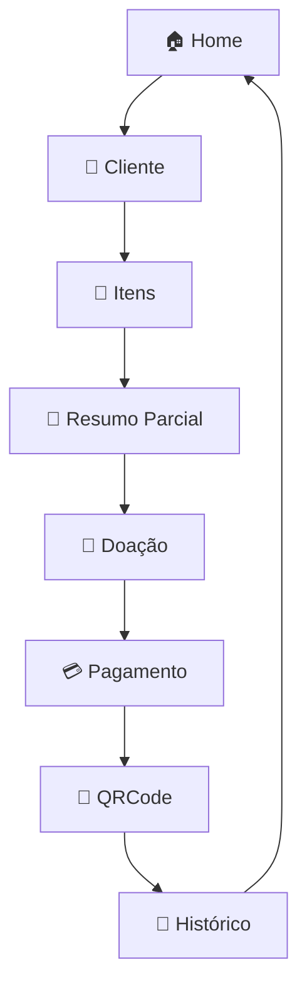

Perfeito, Leo 👇
Aqui está um **README profissional e visualmente bonito** para o seu sistema de **vendas integrado ao Firebase**, seguindo exatamente o fluxo que você descreveu — sem permitir desvios e com destaque para cada parte do processo.

---

# ⚙️ **Sistema de Vendas Integrado ao Firebase**

> 💡 Um sistema de vendas completo, conectado em tempo real ao Firebase, com fluxo linear e inquebrável — do cliente ao QRCode.
> Cada etapa é sincronizada automaticamente com o **Resumo do Caixa**, garantindo precisão e controle absoluto.

---

## 🏠 **Tela Home (Resumo do Caixa)**

📊 **Resumo Dinâmico em Tempo Real**
O sistema exibe automaticamente os dados consolidados do dia:

* 💰 **Total de Vendas do Dia**
* 🎁 **Total de Doações**
* ➖ **Valor Líquido (Vendas – Devoluções)**
* 🧾 **Saldo Final em Caixa**

🔍 **Filtro Inteligente**

* Pesquise por **nome do cliente** ou **ID da venda**.
* Mostra **apenas vendas concluídas** (nunca o estoque).

🚀 **Acesso Rápido**

* Botões diretos para **Aba Venda** e **Histórico**.

---

## 🛒 **Aba Venda (Fluxo Conectado de Criação de Venda)**

### **1️⃣ Identificação do Cliente**

* Input com **autocomplete inteligente** (a partir do 3º caractere).
* Dados vindos do Firebase → `/Clientes`.
* Se não existir → opção **Cadastrar Novo Cliente**.
* ☎️ Telefone é opcional, salvo se preenchido.

---

### **2️⃣ Seleção de Itens**

* Busca por **nome** ou **ID** com autocomplete após 3 caracteres.
* ⚠️ **Validação de estoque em tempo real** — bloqueia caso não haja quantidade suficiente.
* Cada item exibe:

  * Nome
  * Preço Unitário
  * Quantidade Disponível

🧩 Itens adicionados vão direto ao **Resumo Parcial**, atualizando tudo automaticamente.

---

### **3️⃣ Resumo Parcial da Venda**

* Lista completa dos itens:

  * Nome
  * Quantidade
  * Valor Unitário
  * Subtotal
* 💵 **Total acumulado** atualizado em tempo real.

---

### **4️⃣ Doação (Opcional, mas Integrada)**

💖 Caixa de doação com duas opções:

* Input manual de valor.
* Botão **“Adicionar todo o valor pago”** → converte troco em doação.

🧮 O valor da doação:

* Aparece no **Resumo Final**.
* É deduzido do **troco a devolver**.

---

### **5️⃣ Pagamento**

💳 Campo obrigatório: **Valor Pago**.
Validação automática → deve ser **≥ Valor da Compra**.

Exibe:

* Total da Venda
* Valor da Doação (se houver)
* Troco calculado:

  ```
  Troco = Valor Pago – (Total da Venda + Doação)
  ```

Se a doação for integral → troco = **R$ 0,00**.

---

### **6️⃣ Finalizar Venda**

🧾 Ao confirmar:
Registra no Firebase em:

```
/Vendas/{ano}/{mes}/{dia}/{idVenda}
```

📦 Campos obrigatórios:

* Cliente (nome e telefone)
* Itens (nome, quantidade, preço)
* Valor Total
* Valor Pago
* Doação
* Troco
* Status inicial: **Pendente**

📱 **Gera QRCode único** (com `idVenda`)
→ Ao ser escaneado, abre diretamente a venda no Histórico.

---

## 📜 **Aba Histórico (Controle e Acompanhamento)**

📅 Listagem de todas as vendas registradas, com filtros por:

* Data
* Nome do Cliente
* QRCode

### 🔄 **Ações em cada venda**

* ✅ **Entregue** → muda status para *Entregue*.
* 💸 **Troco/Devolução** → permite devolução parcial ou total.

💬 Modal de notificação mostra o novo status:

* Pago
* Pendente
* Devolvido

📡 Toda mudança no Histórico atualiza o **Resumo do Caixa** da Home em tempo real.
Se a venda for aberta via QRCode → exibe automaticamente os detalhes.

---

## 🔒 **Regras Fixas e Inquebráveis**

🚫 Nenhum desvio de fluxo é permitido.
O sistema obedece **exatamente** esta sequência:

```
Cliente → Itens → Resumo → Doação → Pagamento → QRCode → Histórico
```

📏 Regras rígidas:

* Nenhuma etapa pode ser pulada.
* Cada venda gera um **QRCode único**.
* O **Resumo do Caixa** é sempre atualizado após:

  * Venda
  * Doação
  * Devolução
* Em caso de erro, o sistema recusa a ação e redireciona o usuário ao ponto correto do fluxo.

---

## 🧩 **Tecnologias Utilizadas**

| Categoria                   | Ferramenta                              |
| --------------------------- | --------------------------------------- |
| 🔥 Banco de Dados           | Firebase Firestore                      |
| ⚡ Autenticação e Tempo Real | Firebase Auth + Realtime Updates        |
| 🖥️ Front-end               | React.js + TailwindCSS                  |
| 📱 QRCode                   | qrcode.react ou react-qr-code           |
| 🧠 Lógica de Fluxo          | Context API / Zustand                   |
| 🎨 Interface                | Shadcn/UI + animações com Framer Motion |

---

## 🪄 **Fluxo Visual Simplificado**



---

## ✨ **Experiência Final**

> 🔁 Tudo se conecta automaticamente.
> Nenhum clique é perdido.
> Nenhum dado é esquecido.
> O sistema pensa e age como um **vendedor confiável e disciplinado**, conectado 100% ao fluxo Firebase.

---

## 🧠 **Desenvolvido por**

**Leo (leodigory)**
🎓 Estudante de Engenharia da Computação | Designer Gráfico | Dev Web
📧 [01leonardoaraujo@gmail.com](mailto:01leonardoaraujo@gmail.com)
🌎 Fortaleza - CE
